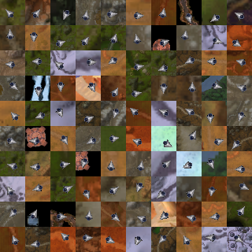

# Predicting player facing from the World of Warcraft minimap by using a CNN

## Key points
- A CNN that predicts the player facing direction from the World of Warcraft minimap cursor.
- Network predicts $(\hat{x}, \hat{y})$ on the unit circle. Predicted player facing is obtained by $atan2(\hat{y}, \hat{x})$.
- Images of size 32x32 that contain the minimap cursor have been used. Each image has been labelled with the correct player facing, $\theta$. 
    - $x = cos(\theta)$ 
    - $y = sin(\theta)$
- Loss = $\sqrt{(\hat{x}-x)^2 + (\hat{y} - y)^2}$

