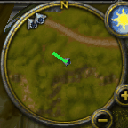

# Predicting player facing from the World of Warcraft minimap compass arrow using a CNN

## What it does
- A CNN that predicts the player facing direction from the World of Warcraft minimap compass arrow.
- Network outputs (x, y) on the unit circle, and facing direction is attained by $atan2(y, x)$.
